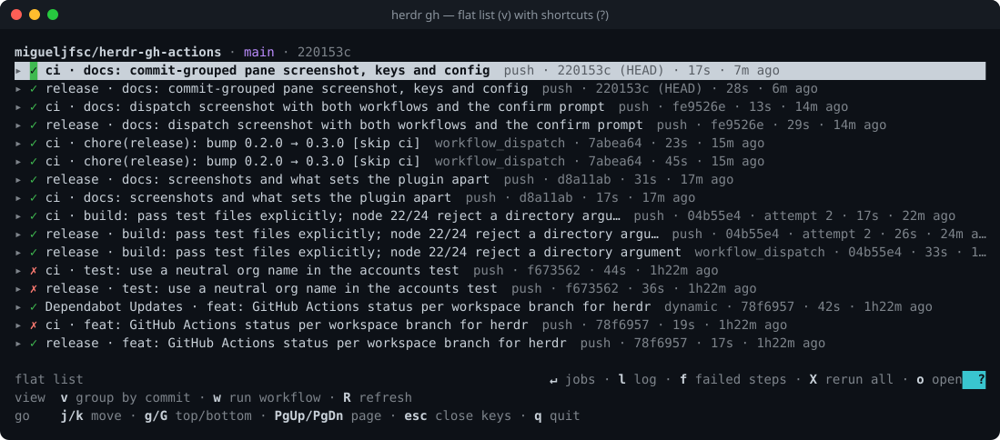

# herdr-gh-actions

[](https://github.com/migueljfsc/herdr-gh-actions/actions/workflows/ci.yml)
[](https://github.com/migueljfsc/herdr-gh-actions/releases)
[](LICENSE)

A [herdr](https://herdr.dev) plugin for GitHub Actions. It shows the CI status of the branch checked
out in each workspace, and lets you drill into runs, read logs, re-run and dispatch workflows without
leaving the terminal.


- **Sidebar token** `$ci` per workspace and per agent pane: `↑ pushed` · `◌ CI 2m` · `✓ CI` · `✗ CI` · `⚠ CI`
- **Pane** with the branch's commits → runs → jobs → steps, full or failed-only logs with search and
  annotations, grouped by commit or as a flat list; the header shows the branch's PR and the default
  branch's status
- **Actions**: re-run failed or all jobs, cancel (per run or per commit), run a `workflow_dispatch`
  workflow with its inputs and follow its run, review pending deployments, download artifacts
- **Agents**: hand a failed run or job to an agent pane in one key
- **Notification** when a watched run fails (or on every finish)

## Why this one?

- **Down to the log line.** Commits → runs → jobs → steps → logs (or failed steps only) inside the
  pane, searchable, with the job's annotations on top.
- **Branch-based, no PR needed.** Shows `↑ pushed` the moment you push, before GitHub has a run.
- **Acts, not just watches.** Re-run, cancel and dispatch workflows on the current branch.
- **Agent-aware.** Agents working in worktrees on other branches get their own status token, and a
  failure goes to an agent with `a`.
- **Work and personal accounts.** Picks the `gh` login per repo owner.
- **Stays out of the way.** A sidebar token you place yourself (it never rewrites workspace names),
  with a TTL so it clears itself if the poller dies.
- **Zero dependencies** beyond `node` and an authenticated `gh`.

## Requirements

- herdr ≥ 0.9 on macOS or Linux
- `node` ≥ 22
- [`gh`](https://cli.github.com), authenticated (`gh auth status`)

## Install

```sh
herdr plugin install migueljfsc/herdr-gh-actions
```

The poller starts with the herdr server. To start it now without restarting the server:

```sh
herdr plugin action invoke refresh --plugin migueljfsc.gh-actions
```

To update, run the install command again. The next `refresh`, pane toggle or new workspace moves the
running poller onto the new version; no herdr restart needed.

## Setup

### Sidebar tokens

Add `$ci` to your sidebar rows in `~/.config/herdr/config.toml`, then `herdr server reload-config`.
Spaces show the workspace's branch; agent rows show the branch the agent's pane is in.

```toml
[ui.sidebar.spaces]
rows = [["state_icon", "workspace"], ["branch", "git_status", { token = "$ci", bold = true }]]

[ui.sidebar.agents]
rows = [["state_icon", "machine", "workspace", "tab"], ["agent", "$ci"]]
```

### Opening the pane

As a split next to the focused pane (run it again to close):

```sh
herdr plugin action invoke toggle --plugin migueljfsc.gh-actions
```

Bound to a key:

```toml
[[keys.command]]
key = "prefix+shift+c"
type = "plugin_action"
command = "migueljfsc.gh-actions.toggle"
description = "GH Actions pane"
```

Or **inline**, in the pane you're in, with `herdr-gh`; `q` returns to the shell. The plugin keeps
`~/.local/bin/herdr-gh` symlinked to its launcher (only when that directory exists, and never over a
real file). A shell wrapper makes it `herdr gh`:

```zsh
herdr() {
  case "$1" in
    gh) shift
        case "$1" in
          toggle|refresh) command herdr plugin action invoke "$1" --plugin migueljfsc.gh-actions ;;
          *) herdr-gh "$@" ;;
        esac ;;
    *) command herdr "$@" ;;
  esac
}
```

## Using the pane

The pane follows the repo and branch it was opened in, and its label carries the plugin version
(`GH Actions v1.2.0`). The footer shows the keys that apply to the selected row; `?` expands it into
every shortcut.

**Header.** Repo, branch and HEAD, then the branch's pull request (`#12 · approved · conflicts`, plus
failing or pending checks from outside Actions, such as commit statuses from other CI) and,
on any other branch, the default branch's latest status (`main ✓`). `p` opens the PR.

**Layouts** (`v` switches; the pane remembers your pick):

- **By commit** (default): the branch's newest commits, each grouping the runs for that commit. Only
  the newest commit starts expanded; when a newer one arrives it takes over, unless you opened or
  closed the previous one yourself.
- **Flat**: one row per run, newest first, for the same commits.



**History.** The list starts with `commits_per_branch` commits. When older ones exist it ends in a
`▾ 10 more commits` row: `Enter` on it (or `m` anywhere) loads the next batch, as far back as the
branch goes. `R` goes back to the first batch.

**Logs.** `l` opens the full log of a job (or a whole run), `f` only its failed steps. A failed job's
failure and warning annotations come first. Logs exist once a job finishes; for a running job the
log view shows live step status and loads the log when the job completes. In a log, `/` searches
(case-insensitive unless the query has a capital), `n`/`N` step through matches and `e`/`E` through
error lines.


**Actions.** `x` re-runs failed jobs, `X` all jobs, `c` cancels: on a run, or on every fitting run of
a commit. `w` lists the workflows with a `workflow_dispatch` trigger and runs one on the current
branch, then selects and follows the run it creates. A workflow with inputs opens a form first:
`Enter` toggles a boolean, picks a choice or environment, or edits text; required inputs are marked
`*`. A run waiting on an environment's protection rules shows `⏸`; `d` approves or rejects it. Each
action asks `y/n` first and names the runs it acts on.

**Artifacts.** `s` lists a run's artifacts; `Enter` downloads one into
`<artifact_dir>/<repo>-<run id>/<name>`.

**Agents.** `a` on a failed run or job writes an excerpt (annotations and the last 80 lines of each
failed step, each line cut to `excerpt_line_chars`, the file capped at `excerpt_max_bytes`) to
`$HERDR_PLUGIN_STATE_DIR/excerpts/` and types a prompt pointing at it into an agent
pane, left for you to submit. Agents whose checkout is this repo come first, then agents in the same
workspace; it asks which one when there are several, and confirms when there is one. The log text
comes from your CI, so treat it like any other input you hand an agent, especially on PRs from forks.
Excerpts are readable only by you. The pane keeps the `excerpt_keep` newest and removes any older
than `excerpt_ttl_days`, each time it starts and after each `a`.


| key | action |
| --- | --- |
| `j`/`k`, `↑`/`↓`, wheel | move |
| `Enter`, `→` | expand/collapse commit, run or job; on a step, open its job log |
| `l` | log of the selected job (or whole run) |
| `f` | failed steps only |
| `x` | re-run failed jobs of the selected run, or of every failed run of the selected commit |
| `X` | re-run all jobs of the selected run, or of every finished run of the selected commit |
| `c` | cancel the selected run, or every active run of the selected commit |
| `w` | run a `workflow_dispatch` workflow on the current branch (inputs first) and follow its run |
| `d` | approve or reject the selected run's pending deployments |
| `s` | list and download the selected run's artifacts |
| `a` | send the selected failed run or job to an agent pane |
| `p` | open the branch's pull request in the browser |
| `v` | switch layout: by commit ↔ flat |
| `m` | load older commits |
| `o` | open the commit, run or job in the browser |
| `R` | refresh now (and back to the first batch of commits) |
| `g`/`G`, `PgUp`/`PgDn` | jump / page |
| `/`, `n`/`N` | in a log: search, next / previous match |
| `e`/`E` | in a log: next / previous error line |
| `?` | show or hide all shortcuts |
| `Esc` | back |
| `q` | quit |

## Configuration

Optional `config.json` in the plugin config directory (`herdr plugin config-dir migueljfsc.gh-actions`),
all keys optional:

```json
{
  "poll_seconds": 10,
  "idle_poll_seconds": 60,
  "notify": "fail",
  "runs_per_branch": 20,
  "commits_per_branch": 10,
  "pane_layout": "commit",
  "pushed_grace_seconds": 300,
  "artifact_dir": "~/Downloads",
  "excerpt_max_bytes": 1048576,
  "excerpt_ttl_days": 7,
  "excerpt_keep": 20,
  "excerpt_line_chars": 500,
  "accounts": { "my-work-org": "my-work-login", "*": "my-personal-login" }
}
```

| key | default | meaning |
| --- | --- | --- |
| `poll_seconds` | 10 | poll interval while a run is active or a push awaits its run |
| `idle_poll_seconds` | 60 | poll interval when everything is settled |
| `notify` | `fail` | `fail`: failed or timed-out runs · `all`: also successes · `off` |
| `runs_per_branch` | 20 | runs the sidebar poller reads per branch to work out the newest commit's status |
| `commits_per_branch` | 10 | commits the pane lists at first, and per `▾ more` batch (1–50) |
| `pane_layout` | `commit` | pane layout until you first press `v`: `commit` or `flat` |
| `pushed_grace_seconds` | 300 | how long `↑ pushed` waits for a run before showing the last run's status |
| `artifact_dir` | `~/Downloads` | where `s` saves artifacts, in a `<repo>-<run id>` folder |
| `excerpt_max_bytes` | 1048576 | size cap of one `a` excerpt file (1 KB – 100 MB) |
| `excerpt_ttl_days` | 7 | days an excerpt is kept |
| `excerpt_keep` | 20 | excerpts kept at most; the oldest go first |
| `excerpt_line_chars` | 500 | characters kept per excerpt line, the rest cut to `…`; `0` keeps lines whole |
| `accounts` | `{}` | repo owner → `gh` login; `*` is the fallback |

**Accounts.** Without `accounts`, `gh`'s active account is used for everything. Reading public repos
works with any account, but re-run, cancel and dispatch need write access, so map your repos' owners
to the logins that can act on them. Tokens come from `gh auth token --user <login>` and live only in
memory. A mapped login without a token falls back to the active account and the token shows `⚠auth`.

## Remote machines

Each herdr machine runs its own server, so install the plugin on the remote too (with `node` and an
authenticated `gh` there). Its poller reports tokens for that machine's workspaces.

## Troubleshooting

| symptom | check |
| --- | --- |
| no token in the sidebar | `$ci` is in your sidebar rows; the repo's `origin` is on GitHub; run the `refresh` action |
| `⚠ CI` | `gh` can't read the repo: `gh auth status`, or map the owner in `accounts` |
| "Must have admin rights" on re-run or dispatch | the account in use can't write to the repo: map it in `accounts` |
| `rate limited until …` in the pane | GitHub's API limit for the account; polling resumes on its own at that time |
| anything else | `herdr plugin log list --plugin migueljfsc.gh-actions` and the poller log below |

## How it works

- `startup` spawns a detached poller per herdr session. Its state lives under
  `$HERDR_PLUGIN_STATE_DIR/sessions/<hash of socket path>/` (`daemon.pid`, `daemon.log`,
  `status.json`), and it exits when its session's socket goes away.
- Each tick: `herdr pane list` → the git checkout of each workspace (the first pane cwd inside a
  GitHub repo; ssh host aliases resolved with `ssh -G`) and of each agent pane → per checkout,
  `git status --porcelain=v2 --branch` → the branch's runs (once per repo and branch) → tokens through
  `herdr workspace|pane report-metadata`, with a TTL of 3× the poll interval.
- Runs are read through `gh api` with `If-None-Match`: an unchanged list comes back as `304 Not
  Modified`, free of rate-limit cost. When the limit is hit, the poller
  keeps the last tokens and waits for the reset time GitHub sends.
- `↑ pushed` means HEAD is on its upstream, newer than the latest run, not marked `[skip ci]`, and no
  run carries it yet.
- The `refresh` action, the `workspace.created` / `worktree.created` events and pane actions wake the
  poller for an immediate tick.
- The poller records its version and plugin root in `daemon.json`; when the `refresh` action, those
  events or the pane toggle find it running other code (after an update), they restart it. The inline
  `herdr-gh` pane never does, so a dev checkout can't take over the installed poller.
- The pane polls `gh` itself and keeps your layout choice in `$HERDR_PLUGIN_STATE_DIR/pane.json`. It
  reads the branch's PR and the default branch's status at the idle interval.

## Development

```sh
herdr plugin link .                                  # run from a checkout (uninstall the released one first)
npm test                                             # node --test, no network
herdr plugin log list --plugin migueljfsc.gh-actions
tail -f ~/.local/state/herdr/plugins/migueljfsc.gh-actions/sessions/*/daemon.log
```

`node bin/pane.js --inline` runs the pane from a checkout in any terminal pane, without touching the
installed plugin.

The screenshots are real pane snapshots rendered to SVG:

```sh
herdr pane read <pane-id> --source visible --ansi > runs.ansi
node scripts/ansi-svg.js runs.ansi docs/pane-runs.svg "herdr gh — commits → runs → jobs → steps"
```

**Releases** are automatic: commits follow [Conventional Commits](https://www.conventionalcommits.org),
and every push to `main` lets commitizen bump the version (`feat` → minor, `fix` → patch), update
`CHANGELOG.md`, tag, and publish a GitHub Release. The `release` workflow can also be run by hand
with an explicit `increment` (`PATCH`, `MINOR` or `MAJOR`).

## License

[MIT](LICENSE)
