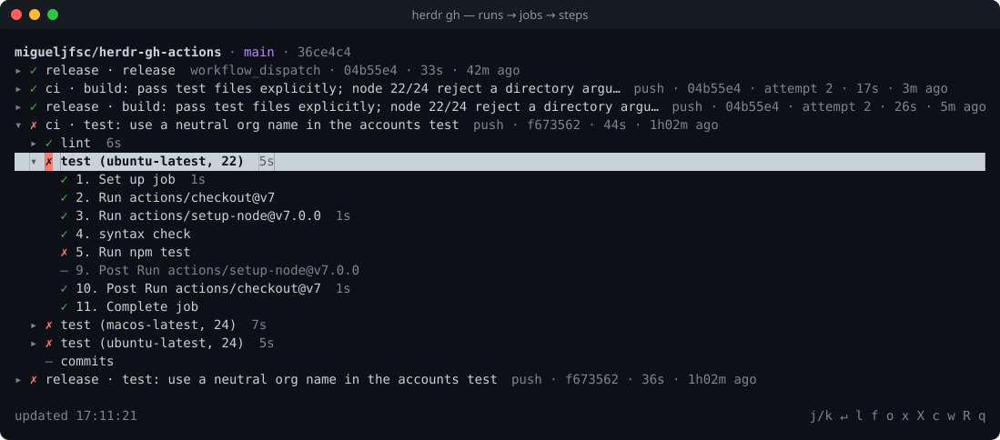
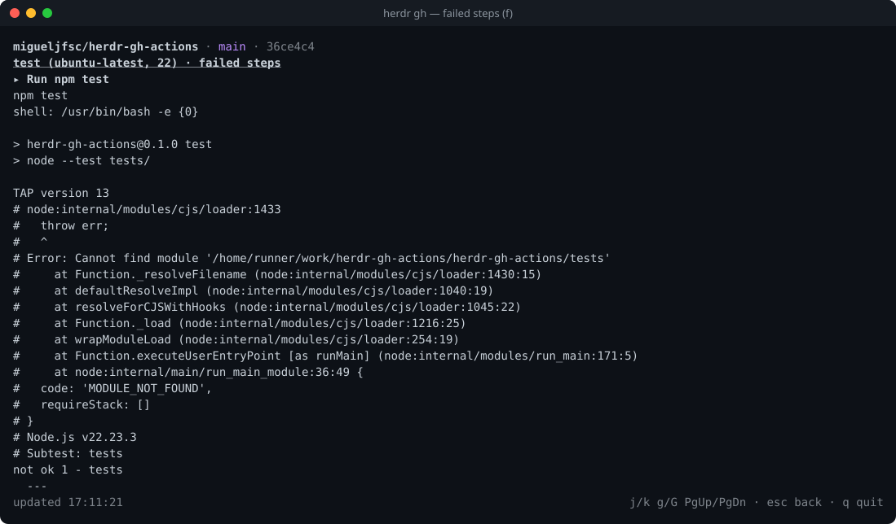
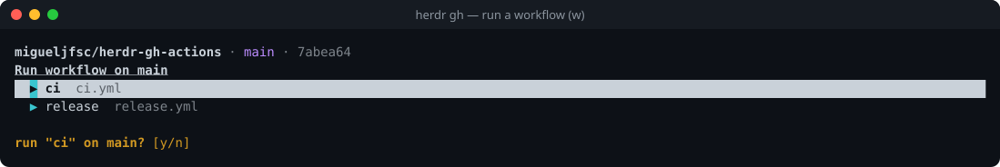

# herdr-gh-actions

[herdr](https://herdr.dev) plugin that shows GitHub Actions status for the branch checked out in
each workspace, and lets you drill into runs, read logs, re-run and dispatch workflows without
leaving the terminal.





- **Sidebar token** `$ci` per workspace and per agent pane: `↑ pushed` · `◌ CI 2m` · `✓ CI` · `✗ CI` · `⚠ CI`
- **Pane** with the branch's latest commits → runs → jobs → steps, full or failed-only logs
- **Actions**: re-run failed or all jobs, cancel (per run or per commit), run a `workflow_dispatch`
  workflow and follow its run
- **Notification** when a watched run fails (or every finish, if you want)

## Why this one?

- **Down to the log line.** Commits → runs → jobs → steps → logs (or failed steps only) inside the
  pane, not just a status dot and a link to the browser.
- **Branch-based, no PR needed.** Shows `↑ pushed` the moment you push, before GitHub has a run.
- **Acts, not just watches.** Re-run, cancel, and dispatch workflows on the current branch.
- **Agent-aware.** Agents working in worktrees on other branches get their own status token.
- **Work and personal accounts.** Picks the `gh` login per repo owner.
- **Stays out of the way.** A sidebar token you place yourself (never rewrites workspace names), with
  a TTL so it clears itself if the poller dies.
- **Zero dependencies** beyond `node` ≥ 22 and an authenticated `gh`.

## Install

```sh
herdr plugin install migueljfsc/herdr-gh-actions
```

The poller daemon starts with the herdr server. To start it without restarting the server, run the
refresh action once: `herdr plugin action invoke refresh --plugin migueljfsc.gh-actions`.

### Sidebar tokens

Add `$ci` to your sidebar rows in `~/.config/herdr/config.toml`, then `herdr server reload-config`.
Spaces show the workspace's branch; agent rows show the branch the agent's pane is in.

```toml
[ui.sidebar.spaces]
rows = [["state_icon", "workspace"], ["branch", "git_status", { token = "$ci", bold = true }]]

[ui.sidebar.agents]
rows = [["state_icon", "machine", "workspace", "tab"], ["agent", "$ci"]]
```

### Open the pane

As a split next to the focused pane (run again to close):

```sh
herdr plugin action invoke toggle --plugin migueljfsc.gh-actions
```

Or bind it:

```toml
[[keys.command]]
key = "prefix+shift+c"
type = "plugin_action"
command = "migueljfsc.gh-actions.toggle"
description = "GH Actions pane"
```

Or run it **inline** in the pane you're in with `herdr-gh`; `q` returns to the shell. The plugin
keeps `~/.local/bin/herdr-gh` symlinked to its launcher (only when that dir exists, never over a
real file). A shell wrapper so `herdr gh` works:

```zsh
herdr() {
  case "$1" in
    gh) shift
        case "$1" in
          toggle|refresh) command herdr plugin action invoke "$1" --plugin migueljfsc.gh-actions ;;
          *) herdr-gh "$@" ;;
        esac ;;
    *) command herdr "$@" ;;
  esac
}
```

## Pane keys

| key | action |
| --- | --- |
| `j`/`k`, `↑`/`↓`, wheel | move |
| `Enter`, `→` | expand/collapse commit, run or job; on a step, open its job log |
| `l` | log of selected job (or whole run) |
| `f` | failed steps only |
| `x` | re-run failed jobs of the selected run, or of every failed run of the selected commit |
| `X` | re-run all jobs of the selected run, or of every finished run of the selected commit |
| `c` | cancel the selected run, or every active run of the selected commit |
| `w` | pick a `workflow_dispatch` workflow and run it on the current branch, then follow its run |
| `o` | open commit/run/job in browser |
| `R` | refresh now |
| `g`/`G`, `PgUp`/`PgDn` | jump / page |
| `Esc` | back |
| `q` | quit |

The pane lists the branch's newest `commits_per_branch` commits, each grouping the workflow runs for
that commit. Only the newest commit starts expanded; when a newer one arrives it takes over, unless
you opened or closed the previous one yourself. Re-run, cancel and dispatch ask `y/n` first and name
the runs they act on. Dispatch uses the
workflow's default inputs. Logs exist only once a job finishes; for a running job the log view
shows live step status and loads the log when the job completes.



## Config

Optional `config.json` in the plugin config dir (`herdr plugin config-dir migueljfsc.gh-actions`):

```json
{
  "poll_seconds": 10,
  "idle_poll_seconds": 60,
  "notify": "fail",
  "runs_per_branch": 20,
  "commits_per_branch": 10,
  "pushed_grace_seconds": 300,
  "accounts": { "my-org": "work-login", "*": "personal-login" }
}
```

| key | default | meaning |
| --- | --- | --- |
| `poll_seconds` | 10 | interval while any run is active or a push awaits its run |
| `idle_poll_seconds` | 60 | interval when everything is settled |
| `notify` | `fail` | `fail`: failed/timed-out runs · `all`: also successes · `off` |
| `runs_per_branch` | 20 | runs the sidebar poller reads per branch to work out the newest commit's status |
| `commits_per_branch` | 10 | commits listed in the pane (it reads the branch's last 100 runs) |
| `pushed_grace_seconds` | 300 | how long `↑ pushed` waits for a run before falling back to the last run |
| `accounts` | `{}` | repo owner → `gh` login; `*` is the fallback. Token via `gh auth token --user <login>` |

Without `accounts`, `gh`'s active account is used. Reading public repos works with any account;
re-run, cancel and dispatch need one with write access, so map your own repos to the login that owns
them. A mapped login without a token falls back to the active account and the token shows `⚠auth`.

## Remote machines

Each herdr machine runs its own server, so install the plugin on the remote too (it needs `node` and
an authenticated `gh` there). Its daemon reports tokens for the remote's workspaces like it does
locally.

## How it works

- `startup` spawns a detached daemon per herdr session (state under
  `$HERDR_PLUGIN_STATE_DIR/sessions/<hash of socket path>/`: `daemon.pid`, `daemon.log`, `status.json`).
  It exits when the session's socket disappears.
- Each tick: `herdr pane list` → the git checkout of each workspace (first pane cwd inside a GitHub
  repo; ssh host aliases resolved via `ssh -G`) and of each agent pane → per checkout,
  `git status --porcelain=v2 --branch` → `gh run list` (deduped per repo+branch) → tokens via
  `herdr workspace|pane report-metadata` with a TTL of 3× the interval.
- `↑ pushed`: HEAD is on its upstream, newer than the latest run, not marked `[skip ci]`, and no run
  carries it yet.
- `refresh` action, `workspace.created`/`worktree.created` events and pane actions send `SIGUSR1` for
  an immediate tick.
- The pane is pinned to the repo it was opened in and polls `gh` itself.

## Development

```sh
npm test                                            # node --test, no network
herdr plugin log list --plugin migueljfsc.gh-actions
tail -f ~/.local/state/herdr/plugins/migueljfsc.gh-actions/sessions/*/daemon.log
```

The screenshots are real pane snapshots rendered to SVG:

```sh
herdr pane read <pane-id> --source visible --ansi > runs.ansi
node scripts/ansi-svg.js runs.ansi docs/pane-runs.svg "herdr gh — runs → jobs → steps"
```

## License

MIT
